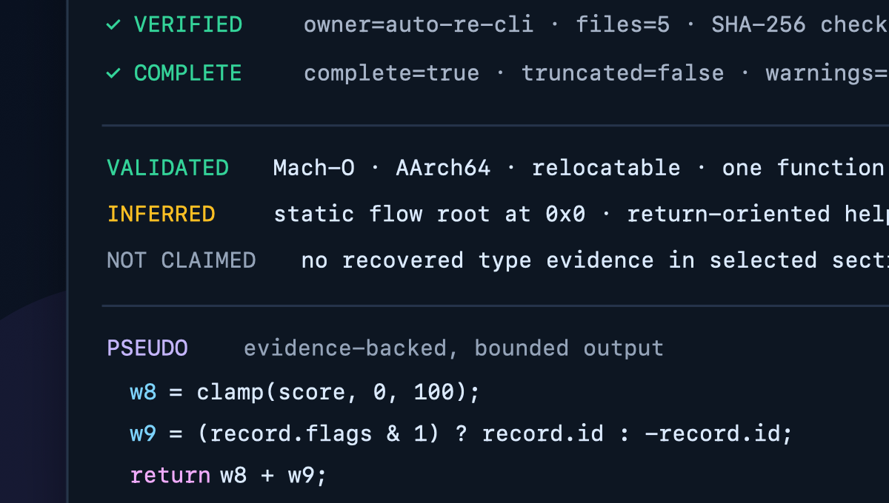

# AutoRE-CLI

[English](README.md) | [简体中文](README_zh.md)

[](https://github.com/timwhitez/AutoRE-CLI/actions/workflows/validate.yml)
[](https://github.com/timwhitez/AutoRE-CLI/releases/latest)
[](#支持平台)
[](LICENSE-MIT)

**面向人类分析师与 AI Agent 的有界纯静态逆向工程工具。**

AutoRE-CLI 把 ELF、PE/COFF、Mach-O、object file 和明确标识的 raw shellcode
转换为可追溯 JSON、CFG/IL、可读 pseudo、语言证据与安全的下一步动作，全程不执行
目标字节。



[下载](https://github.com/timwhitez/AutoRE-CLI/releases/latest) ·
[Agent 快速开始](#agent-快速开始) · [CLI 快速开始](#cli-快速开始) ·
[为什么选择 AutoRE-CLI](#为什么选择-autore-cli) · [安全说明](SECURITY.md) ·
[常见问题](FAQ_zh.md)

## 为什么选择 AutoRE-CLI

- **证据强于自信**：结论明确区分 `validated`、`inferred`、`unresolved` 与
  `not_claimed`。
- **适合 Agent 的上下文**：有界 JSON、预算、warning、stop reason、经过验证的
  bundle 和精确 `next_actions[].argv`，避免输出失控。
- **纯静态安全边界**：不执行目标、恢复 payload、shellcode、embedded object
  或任何目标派生产物。
- **分层检查能力**：反汇编、CFG、LLIL、MLIL、HLIL、CUSTOM IL、pseudo、
  types、calls、data references、PE inventory 与 Go/Rust 证据。
- **可重复调查**：archive、replay、semantic diff 和 batch comparison 保留完整
  证据路径。
- **离线且可追溯**：安装过程不访问网络；每个发行 binary 都有明确 target、
  byte count、源码 revision、签名状态和 SHA-256。

### 与其他工具的关系

| 工具 | 最适合的场景 | AutoRE-CLI 的差异 |
| --- | --- | --- |
| Ghidra、Rizin、angr | 可扩展交互式框架与定制分析 | AutoRE-CLI 是预构建、CLI-first、适合自动化和 Agent 的有界证据接口 |
| Ghidra MCP 集成 | 用自然语言操作现有 Ghidra 环境 | AutoRE-CLI 不需要 GUI 或分析服务，并把纯静态边界写入输出契约 |
| capa | 基于规则识别 binary capability | AutoRE-CLI 还提供函数、CFG/IL、pseudo、引用、语言证据与对比工作流 |
| 通用 binary-analysis Skill | 在独立工具之上提供分析方法 | 本项目的 Skill 与 CLI 共用同一套已验证 action、artifact 和 evidence contract |

AutoRE-CLI 不是 debugger、emulator 或 sandbox，也不声称完美恢复源码。如果需要
插件生态、交互式 GUI、符号执行或动态观测，应使用相应的大型框架。

## 安装

要求是 Python 3.9 或更高版本以及受支持的主机；不需要 Rust toolchain 或源码
checkout。

### 单平台发行包

从 [GitHub Releases](https://github.com/timwhitez/AutoRE-CLI/releases/latest)
下载对应主机的压缩包，然后验证并安装：

```sh
tar -xzf AutoRE-CLI-0.1.1-macos-arm64.tar.gz
cd AutoRE-CLI-0.1.1-macos-arm64
./verify.sh
./install.sh
auto-re-cli --version
```

可以把 `macos-arm64` 替换为 `macos-x86_64`、`linux-x86_64` 或
`linux-arm64`。Windows 用户解压
`AutoRE-CLI-0.1.1-windows-x86_64.zip` 后运行：

```powershell
py -3 scripts/autore_distribution.py verify
py -3 scripts/autore_distribution.py install
auto-re-cli --version
```

每个约 7–8 MB 的单平台包只包含一个 binary，以及 Agent Skill、离线安装器、
provenance、checksums 与第三方 notice。也可以 clone 仓库获取完整平台矩阵：

```sh
git clone --depth 1 https://github.com/timwhitez/AutoRE-CLI.git
cd AutoRE-CLI
./verify.sh
./install.sh
```

### 包管理器

包管理器只安装 CLI。Agent Skill 需要单独安装；如果希望获得完整且经过验证的发行
内容，请使用上面的单平台压缩包。

```sh
# 为 Codex、Claude Code、Cursor 等客户端安装 Agent Skill
npx skills add \
  https://github.com/timwhitez/AutoRE-CLI/releases/download/v0.1.1/AutoRE-CLI-0.1.1-auto-re-skill.zip -g
```

```powershell
# 在 Windows 上通过 Scoop 安装 CLI
scoop install https://raw.githubusercontent.com/timwhitez/AutoRE-CLI/main/packaging/scoop/autore-cli.json
```

仓库内包含版本化
[Homebrew formula](https://github.com/timwhitez/AutoRE-CLI/blob/main/packaging/homebrew/autore-cli.rb)
与
[Scoop manifest](https://github.com/timwhitez/AutoRE-CLI/blob/main/packaging/scoop/autore-cli.json)。
Homebrew formula 已为独立 Tap 准备好；在 Tap 发布前，请使用经过验证的 macOS
或 Linux 单平台包。包管理器可用时间可能稍晚于 GitHub Release。

默认安装位置：

- CLI：`${AUTORE_INSTALL_DIR:-$HOME/.local/bin}/auto-re-cli`，Windows 为
  `auto-re-cli.exe`；
- Trae Skill：`${TRAE_HOME:-$HOME/.trae}/skills/auto-re`；
- Agent Skill：`$HOME/.agents/skills/auto-re`。

安装器会验证解压后的完整发行内容，只用 `--version` 探测已验证 binary，复制而非
symlink，记录 managed marker，并拒绝覆盖 unmanaged destination，除非显式使用
`--replace-unmanaged`。

常用选项：

```sh
./install.sh --dry-run
./install.sh --cli-only
./install.sh --skill-only --agents trae
./install.sh --skill-only --agents codex
./install.sh --skill-only --agents both
./install.sh --install-dir "$HOME/bin"
./install.sh --skill-only --agents codex --codex-home "$HOME/.codex"
```

`--codex-home` 选择旧版 `<home>/skills` 兼容路径；当前默认路径是
`$HOME/.agents/skills`。

### 更新与卸载

解压新版本后重新运行 `./verify.sh` 和 `./install.sh`。managed drift、同版本
binary repack、降级和额外 Skill 文件都会 fail closed。

```sh
./uninstall.sh
./uninstall.sh --force-managed
```

`--force-managed` 只作用于 marker 列出的已修改文件，不会授权删除无关父目录或
额外用户文件。

## Agent 快速开始

安装后重启或刷新 Agent，然后调用：

```text
使用 $auto-re 对 ./sample.exe 进行纯静态分析，把有界、可追溯的结论写入
./analysis-results。不得执行样本或任何目标派生产物。
```

Skill 会先验证 CLI；读取 bundle payload 前检查 ownership、size 和 SHA-256；
分离不同证据强度；每次只跟随一个相关的静态 continuation；并在证据或预算边界处
停止。

可用 helper 在不经过 shell interpolation 的情况下准备 emitted action：

```sh
python3 skills/auto-re/scripts/run_next_action.py \
  ./analysis-results/sample.bundle/manifest.json \
  --action-stage function.selected \
  --output ./analysis-results/function-selected.json \
  --dry-run
```

检查准确 argument vector 后再移除 `--dry-run`。已经拥有 bundle/spill sink 的
action 会拒绝额外 `--output`。

## CLI 快速开始

### 有界 Context Bundle

```sh
mkdir -p ./analysis-results
auto-re-cli report ./sample.exe \
  --format json \
  --json-profile ai \
  --sections binary,summary,inspections,flow,functions,types \
  --limit 8 \
  --bundle-dir ./analysis-results/sample.bundle \
  --output ./analysis-results/sample.bundle/manifest.json

python3 skills/auto-re/scripts/verify_bundle.py \
  ./analysis-results/sample.bundle/manifest.json
```

Manifest 会记录 command-owned payload path、byte count、SHA-256、warning、
budget、completion state、current finding 和有界 next action。

### 聚焦函数

```sh
auto-re-cli function ./sample.exe \
  --addr 0x401000 \
  --format json \
  --output ./analysis-results/function-401000.json

auto-re-cli dump-il ./sample.exe \
  --level custom \
  --addr 0x401000 \
  --format json \
  --output ./analysis-results/custom-il-401000.json
```

### 复现安全 Demo

[`examples/controlled/fixture.c`](examples/controlled/fixture.c) 是独立编写的无害
fixture。把它构建为不可运行的 object，然后执行
[`examples/controlled/README.md`](examples/controlled/README.md) 中的命令。
实测 Demo 找到一个 AArch64 函数，在没有 truncation 或 warning 的情况下完成，并把
缺失的类型证据保留为 `not_claimed`。

### 显式 Raw Shellcode

```sh
auto-re-cli report ./stage.bin \
  --raw-shellcode \
  --arch x86 \
  --base-address 0x1000 \
  --entry-address 0x1000 \
  --format json \
  --json-profile ai \
  --sections summary,flow,functions \
  --bundle-dir ./analysis-results/raw.bundle \
  --output ./analysis-results/raw.bundle/manifest.json
```

raw architecture、base 和 entry 必须由调用者提供，不能从文件名猜测。

## 分析能力

| 任务 | 命令 |
| --- | --- |
| Aggregate triage | `report`、`analyze`、`decompile` |
| Function 与 local slice | `function`、`slice-function` |
| IL 与 CFG | `dump-il`、`dump-cfg`、`inspect-passes` |
| 静态关系 | `inspect-flow`、`call-graph`、`data-xrefs`、`aarch64-refs` |
| PE inventory | `pe-resources`、`pe-strings` |
| 语言证据 | `inspect-go`、`inspect-rust`、`inspect-types` |
| Protection evidence | `inspect-die`、`inspect-upx`、`inspect-vmp` |
| 可重复比较 | `batch`、`archive`、`replay`、`diff`、`batch-diff` |

使用 `auto-re-cli <command> --help` 查看当前安装版本的准确参数。

## 支持平台

| 主机 | 发行 target | 状态 |
| --- | --- | --- |
| macOS Apple Silicon | `macos-arm64` | 已发布；ad-hoc signed |
| macOS Intel | `macos-x86_64` | 已发布；ad-hoc signed |
| Linux x86-64 | `linux-x86_64` | 已发布 |
| Linux AArch64 | `linux-arm64` | 已发布 |
| Windows x86-64 | `windows-x86_64` | 已发布；未签名 |

macOS binary 没有 Developer ID 签名，也没有 notarization。Windows binary 支持
Windows 10 或更高版本，且没有 Authenticode 签名。

## 完整性与来源

安装前运行 `./verify.sh`。它验证：

- 每一行 `SHA256SUMS` 和准确的公开文件集合；
- `manifest/release.json` 中每个 binary 的 target/path/size/hash；
- 精确的 managed Skill 文件集合；
- MIT-only 项目许可证边界；
- 个人 publisher 与 repository identity；
- 不含源码根、Rust 源码、私有路径、样本、内部产物以及受管控内部账号标识。

`manifest/release.json` 记录 publisher、repository URL、版本、distribution
scope、源码 revision、toolchain、target matrix 和 static-safety flags。
第三方许可独立保存在 `THIRD_PARTY_LICENSES.md` 与 `licenses/third-party/`。

## 公开仓库边界

本仓库是 Auto-RE 的 MIT 许可**公开二进制发行仓**，包含编译后二进制、开源 Agent
Skill 与 helper、安装与校验脚本、Release 自动化、受控 Demo 源码、checksums、
provenance、第三方 notice 和文档。

引擎的 Rust 实现、私有规格、样本与分析输出没有在此公开。本仓库中的“开源”仅适用于
公开脚本、Skill、example、自动化和文档，不代表 binary engine 的实现源码可用。

## 仓库结构

```text
assets/                       Demo 与社交传播素材
bin/                          多平台 binary
examples/controlled/          无害且可复现的 Demo 源码
skills/auto-re/               Agent Skill 与 deterministic helper
scripts/autore_distribution.py
scripts/build_release_assets.py
manifest/release.json         机器可读来源
licenses/third-party/         第三方许可
SHA256SUMS                    外层完整性清单
install.sh / uninstall.sh     managed 本地安装
verify.sh                     fail-closed 发行校验器
```

## 支持

- Bug 与文档：[Issues](https://github.com/timwhitez/AutoRE-CLI/issues)
- 用例与集成需求：[公开讨论](https://github.com/timwhitez/AutoRE-CLI/discussions/1)
- 安全问题：[私密漏洞报告](https://github.com/timwhitez/AutoRE-CLI/security/advisories/new)
- 贡献边界：[CONTRIBUTING.md](CONTRIBUTING.md)
- 发行记录：[CHANGELOG.md](CHANGELOG.md)
- 维护者：[@timwhitez](https://github.com/timwhitez)

不要上传恶意样本、恢复 payload、secret、私有路径或 proprietary analysis output。

## 许可证

AutoRE-CLI 公开发行内容使用 [MIT License](LICENSE-MIT)。第三方依赖保留各自
许可证，其中可能包含 Apache 许可依赖，详见
[THIRD_PARTY_LICENSES.md](THIRD_PARTY_LICENSES.md)。
